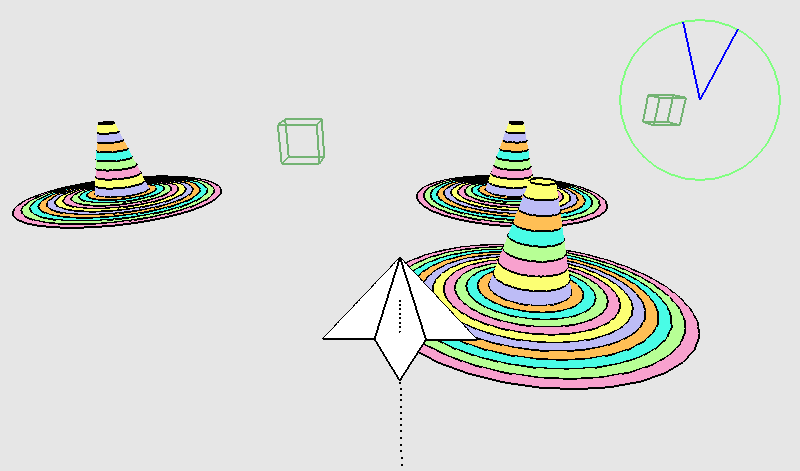

## Game image:  

  
This is a "paper airplane flight simulator" that I found on the Pygame website (https://www.pygame.org/) over a decade ago.  
Since it's no longer on the Pygame website, I've decided to post it here as a cultural heritage.  
  
## How to use:  
  
### Install Python 3 on your PC:  
(Download the version for your PC from https://www.python.org/downloads/)  
  
### Install the Python libraries:  
pip install pygame -U  
pip install PyOpenGL -U  
pip install PyOpenGL-accelerate -U  

### Start the script:  
cd FlightSim  
python main.py  
  
### How to control a paper airplane:  
  
- Put the mouse cursor within the flight simulator screen.  
  
- Move the mouse cursor up ---> The nose of the plane will lower.  
- Move the mouse cursor down ---> The nose of the plane will rise.  
- Move the mouse cursor right ---> The plane will tilt to the right.  
- Move the mouse cursor left ---> The plane will tilt to the left.  
  
- Control the paper airplane and fly through the cubes floating in the air (this will earn you points).  
  
- Put the mouse cursor in the console and press Ctrl+C ---> Game over  
  
